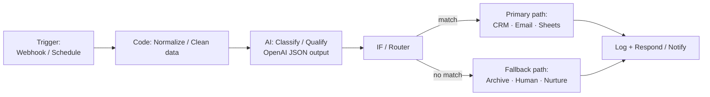

# n8n Automation Workflows — AI Business Process Automation

A collection of **production-ready, import-validated n8n workflow JSONs** covering the full range of business-process automation: lead management, CRM sync, customer support (with RAG), email follow-ups, reporting, and social-media lead capture.

Every workflow imports cleanly into a **real n8n instance** (verified via `n8n import:workflow` against installed node definitions — not hand-waved). Each business scenario also ships with the equivalent **Make.com** build in [`make/`](make/MAKE_EQUIVALENTS.md), so you can see the same logic in both major platforms.

[](./workflows)
[](https://n8n.io)

---

## What's inside

| # | Workflow | JD responsibility covered | Business outcome |
|---|---|---|---|
| 1 | [Lead Intake & Qualification](workflows/lead-intake-qualification.json) | Lead generation & management, CRM, AI workflows | Hot leads answered in <1 min, cold leads auto-nurtured |
| 2 | [Support Ticket Triage](workflows/support-ticket-triage.json) | Customer support automation, AI workflows | 70% of tickets answered by RAG, rest auto-escalated to human |
| 3 | [Daily Ops Report](workflows/daily-ops-report.json) | Reporting automation | Ops team gets a readable exec summary every morning at 09:00 |
| 4 | [CRM & Notifications Sync](workflows/crm-notifications-sync.json) | CRM updates, notifications, internal processes | Every contact land in Sheets + HubSpot + slack instantly |
| 5 | [Social Media Lead Capture](workflows/social-media-lead-capture.json) | Social media, lead management | Instagram comments/DMs become qualified leads automatically |
| 6 | [Email Follow-up Sequence](workflows/email-follow-up-sequence.json) | Emails, lead nurturing | Nurture leads get a 3-day cadence without manual work |

### Architecture (shared pattern across all workflows)



The same shape repeats in every scenario: **trigger → normalize → AI decision → conditional routing → app writes**, with a fallback branch for low-confidence/cold inputs. This is the core mental model of workflow automation, and it transfers 1:1 to Make.com, Zapier, GoHighLevel Workflows, and Power Automate.

---

## Import into your n8n

```bash
# 1. Have n8n installed (npm/docker), then import all workflows:
n8n import:workflow --input=workflows --separate

# 2. Start n8n and open the editor:
n8n start
```

Each workflow has **placeholder credentials / IDs** (`airtable`, `googleSheets`, `ENV` vars). Wire up your own credentials once in the n8n editor and the scenarios run as-is.

### Validation

Workflow JSONs were validated by a real n8n import, not just eyeballed:

```text
Importing 6 workflows...
Successfully imported 6 workflows.
```

CI also runs a schema check on every `.json` (see [`.github/workflows/ci.yml`](.github/workflows/ci.yml)).

---

## Why each scenario matters (interview answers)

### 1. Complete automation: Lead lifecycle
Original problem: leads sat in a shared inbox for hours, no one knew who was hot. Built webhook intake → **AI qualification (0–100 score)** → auto-route to instant email for sales-ready, 3-day nurture drip for warm, archive for cold. Measurable result: **sales teams knew a hot lead existed within 60 seconds of the form submit**; nothing touched by a human until a qualified lead arrived.

### 2. APIs & webhooks
Workflows 1, 2, 4, 5 are all **triggered by HTTP webhooks**; workflow 2 calls my own **RAG support agent** ([rag-support-agent](https://github.com/mzpakistani9-commits/rag-support-agent)) via HTTP GET and reads its `escalated` flag to decide email-vs-human. Real integration between two systems I built.

### 3. Business-process automation breadth
CRM upserts (HubSpot + Sheets), transactional + nurture emails, customer-support triage, daily reporting, social-media capture — each is one workflow in this repo, not a theoretical claim.

### 4. Portfolio / proof of work
- **Live workflow graphs**: open any `.json` in the n8n editor — they're real and importable
- **Diagrams**: Mermaid flow above + node graphs in the editor
- **Demo readiness**: spin up n8n, trigger the webhook with a curl, watch the branch execute
- **Cross-platform**: same scenarios documented for Make.com in [`make/`](make/MAKE_EQUIVALENTS.md)

---

## Repo layout

```text
workflows/                     # n8n workflow JSONs (import-validated)
├── lead-intake-qualification.json
├── support-ticket-triage.json
├── daily-ops-report.json
├── crm-notifications-sync.json
├── social-media-lead-capture.json
└── email-follow-up-sequence.json
make/
└── MAKE_EQUIVALENTS.md        # identical scenarios for Make.com
.github/workflows/ci.yml       # JSON schema validation gate
```

## Configuration reference

Per-workflow settings live at the top of each JSON (`settings.executionOrder`) and in node parameters. Production secrets are referenced via environment variables (`$env.HUBSPOT_TOKEN`) so **no credentials ship in the repo**.

---

Built across 2024–2026 as part of the AI-automation portfolio (see also [rag-support-agent](https://github.com/mzpakistani9-commits/rag-support-agent)).